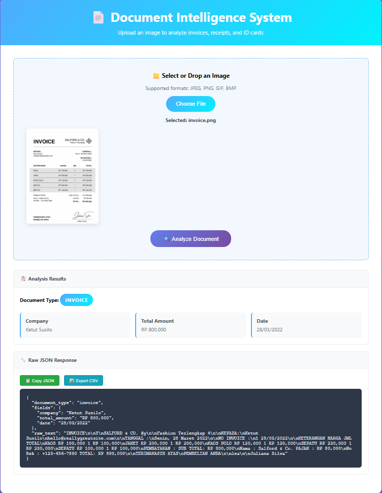

# Document Intelligence System

A lightweight FastAPI-based service for processing document images using OCR and extracting structured information.



## Features

- **OCR Text Extraction**: Uses pytesseract to extract text from uploaded images
- **Document Classification**: Simple keyword-based classification for:
  - Invoices
  - Receipts  
  - ID Cards
- **Field Extraction**: Extracts key fields based on document type:
  - **Invoice**: company, date, total_amount
  - **Receipt**: vendor, total_paid, date
  - **ID Card**: name, birth_date, id_number
- **JSON Output**: Returns structured data in consistent format

## Setup

### Prerequisites

1. **Install Tesseract OCR**:
   - **Windows**: Download from https://github.com/UB-Mannheim/tesseract/wiki
   - **macOS**: `brew install tesseract`
   - **Linux**: `sudo apt-get install tesseract-ocr`

2. **Python 3.8+**

### Installation

1. Install dependencies:
```bash
pip install -r requirements.txt
```

2. Configure Tesseract path (Windows only):
   - Uncomment and update the tesseract path in `main.py` if needed:
   ```python
   pytesseract.pytesseract.tesseract_cmd = r'C:\Program Files\Tesseract-OCR\tesseract.exe'
   ```

### Running the Application

```bash
python main.py
```

Or using uvicorn:
```bash
uvicorn main:app --reload
```

The API will be available at `http://localhost:8000`

### Web Interface

Access the user-friendly web interface at `http://localhost:8000` to upload and analyze documents through your browser.

## API Usage

### POST /analyze

Upload an image file for document analysis.

**Request:**
- Method: POST
- Endpoint: `/analyze`
- Content-Type: multipart/form-data
- Body: Image file (JPEG, PNG)

**Response:**
```json
{
  "document_type": "invoice",
  "fields": {
    "company": "BFI TECH",
    "date": "2025-07-31",
    "total_amount": "IDR 2,450,000"
  },
  "raw_text": "...full extracted OCR text here..."
}
```

### Testing with curl

```bash
curl -X POST "http://localhost:8000/analyze" -F "file=@your_document.jpg"
```

### Testing with the Test Script

The project includes a comprehensive test script that creates sample documents and tests the API:

```bash
python test_api.py
```

This will:
- Create sample invoice and receipt images
- Save them to the `samples/` directory
- Test the API endpoints automatically
- Display the analysis results

## API Documentation

Once running, visit:
- **Interactive docs**: http://localhost:8000/docs
- **Alternative docs**: http://localhost:8000/redoc

## Project Structure

```
├── main.py                    # Main FastAPI application
├── requirements.txt           # Python dependencies  
├── test_api.py               # Test script with sample document generation
├── TEST.ipynb                # Jupyter notebook for testing
├── README.md                 # This file
├── static/
│   └── index.html            # Web interface for document upload
├── samples/                  # Sample document images
│   ├── invoice.png           # Sample invoice image
│   ├── receipt.jpg           # Sample receipt image
│   └── KTP.jpeg             # Sample ID card image
└── .github/
    └── images/
        └── Demo.png          # Demo screenshot
```

## Document Types Supported

1. **Invoices**: Detects billing documents and extracts company, amount, date
2. **Receipts**: Identifies purchase receipts and extracts vendor, total, date  
3. **ID Cards**: Recognizes identity documents and extracts name, ID number, birth date

### Sample Images

The project includes sample images in the `samples/` directory:
- `invoice.png` - Sample invoice document
- `receipt.jpg` - Sample receipt document  
- `KTP.jpeg` - Sample Indonesian ID card

You can test the API with these samples or use the test script to generate new ones.

## How It Works

1. **Image Upload**: Accepts image files via HTTP POST or web interface
2. **OCR Processing**: Extracts raw text using pytesseract
3. **Classification**: Uses keyword matching to determine document type
4. **Field Extraction**: Applies regex patterns based on document type
5. **JSON Response**: Returns structured data with extracted information

## Testing & Development

### Automated Testing
```bash
# Run the test script to generate samples and test API
python test_api.py
```

### Interactive Testing
- Use the web interface at `http://localhost:8000`
- Upload your own document images
- View real-time analysis results

### Jupyter Notebook
Open `TEST.ipynb` for interactive development and testing of the OCR and classification logic.

## Limitations

- Simple keyword-based classification (not ML-based)
- Regex pattern matching for field extraction
- Works best with clear, high-quality scanned documents
- English language optimized

## Future Enhancements

- Add support for more document types
- Implement ML-based classification  
- Add confidence scores
- Support for multiple languages
- Database logging of results
- Batch processing capabilities
- Enhanced web interface with preview

## Contributing

1. Fork the repository
2. Create a feature branch
3. Make your changes
4. Test with `python test_api.py`
5. Submit a pull request

## License

MIT License - see LICENSE file for details
